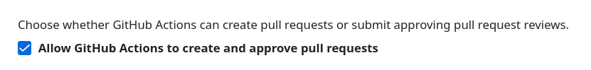

# Readme
- copy content of this repository to your project
- setup python environment `python3 -m venv .venv`
- activate it `source .venv/bin/activate`
- install dependencies `pip install -r requirements.txt`
- install pre-commit hook `pre-commit install --hook-type commit-msg`
- reset version in `.cz.json` to `0.0.1`

# Copy content of repository into yours
`curl -L https://github.com/marinecircuits/kicad-template/archive/refs/heads/main.tar.gz | tar -xz --strip-components=1`

# Variables
These variables are relevant for this template / workflow:
- `${ISSUE_DATE}`: the release PR workflow will update this with the current date, in the `YYYY-MM-DD` format (the only date format you should ever use by the way). It is committed and added in the PR as a change
- `${REVISION}`: the release PR will update this with the git tag (not 100% true, the git tag will be only created one the PR is merged into main, but the result is the same). It is committed and added in the PR as a change. This field will have `+!` appended if it's not a released version.
- `${COMMENT9}`: before kibot is invoked on github, this variable is updated with the short git hash from `git rev-parse --short HEAD`. It is committed and added in the PR as a change

# Versioning
It follows the semantic versionin approach.
Schematics and PCB always have the same version.
Anything breaking functional interfaces will be a breaking change which increments the major version. 
This includes board shape, connector position.
TBD: will adding functionality without breaking interfaces just increment the minor version? Difficult to say if adding a connector will interfere with an existing case or other mechanical constraints.
Changes in schematics which do not affect anything electrical (documentation, re-organize wires) will increment a patch.
Changes in schematics which affect the value of a component, new connections, removal of components will increment a minor version.
# Assembly variant
This is a property of the BOM. At the moment variants are not fully supported (or better: only one variant is fully supported).
VARIANT.md lists all the different variants with a textual description with the differences with respect to variant 1.

# Github
In github you must allow actions to create pullrequest for this workflow to be working.
Under `Settings`, `Actions`, `General` this settings must be enabled. If greyed out, it must be enabled at the organization level.

# Description of usage
## Daily use
During daily work, the user branches off from main, makes changes, commits them, pushes to github, opens a PR, and merges the changes back to main. It is important to commit using the commitizen commit format, otherwise the whole versioning will not make sense. Checkout the [documentation](https://commitizen-tools.github.io/commitizen/tutorials/writing_commits/).
When a PR to main is opened, the jobs inside `.github/worflows/pullrequest.yml` get triggered.
The worflow will call `.github/workflows/module-kibot.yml`, which generates all the files needed for production.
In `kibot.yaml` the output files can be tweaked. The most important thing is to have `dont_stop` set to `false` under `preflight` in `erc` and `drc`, such that the workflow will fail and nothing broken is merged into main.
## Release process
### Pull request
A release is started by invoking the *Create Release PR* Action. This will trigger the jobs inside `.github/workflows/create-release-pr.yml`. 
First, commitizen will bump the version, create (update) the `CHANGELOG.md`.
Then the `date`, `rev`, `comment 9` fields are updated and committed to a release branch `release/v$VERSION`. Then, a pull request to main is opened.
The user can now inspect the changes and merge it.
### Release
Once the PR has been merged, the jobs inside `.github/workflows/tag-release-merge.yml` are triggered.
The job extracts the version from the pull request title and creates a corresponding tag on `main`. The kibot workflow is invoked, and artifacts are generated.
An official Github release `Release X.Y.Z` is created and the production files are uploaded to it.
